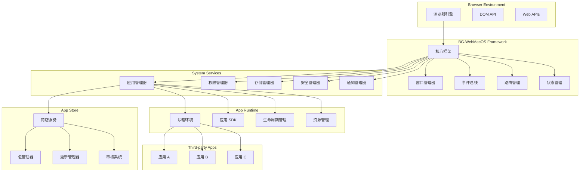

# BG-WebMacOS 应用生态系统架构设计

## 📋 目录

1. [概述](#概述)
2. [整体架构](#整体架构)
3. [核心组件](#核心组件)
4. [应用隔离机制](#应用隔离机制)
5. [权限管理系统](#权限管理系统)
6. [应用生命周期](#应用生命周期)
7. [数据存储架构](#数据存储架构)
8. [通信机制](#通信机制)
9. [应用商店架构](#应用商店架构)
10. [安全架构](#安全架构)
11. [性能优化](#性能优化)
12. [扩展性设计](#扩展性设计)

## 🎯 概述

### 设计目标

BG-WebMacOS 应用生态系统旨在创建一个安全、高效、可扩展的 Web 桌面环境，支持第三方应用的开发、分发和运行。核心设计目标包括：

- **框架与应用隔离**：确保系统框架与第三方应用完全隔离
- **安全沙箱**：每个应用运行在独立的安全沙箱中
- **权限控制**：细粒度的权限管理和访问控制
- **生命周期管理**：完整的应用生命周期管理机制
- **高性能**：优化的资源管理和渲染性能
- **可扩展性**：支持插件化和模块化扩展

### 核心原则

1. **安全第一**：所有设计决策都以安全为首要考虑
2. **隔离优先**：应用间、应用与系统间严格隔离
3. **性能导向**：优化用户体验和系统性能
4. **开发友好**：提供简洁易用的开发接口
5. **标准兼容**：遵循 Web 标准和最佳实践

## 🏗️ 整体架构

### 分层架构

```
┌─────────────────────────────────────────────────────────────┐
│                    第三方应用层 (Apps Layer)                    │
├─────────────────────────────────────────────────────────────┤
│                   应用运行时层 (Runtime Layer)                  │
├─────────────────────────────────────────────────────────────┤
│                   应用管理层 (Management Layer)                 │
├─────────────────────────────────────────────────────────────┤
│                    系统服务层 (Services Layer)                  │
├─────────────────────────────────────────────────────────────┤
│                    核心框架层 (Framework Layer)                 │
├─────────────────────────────────────────────────────────────┤
│                    浏览器层 (Browser Layer)                    │
└─────────────────────────────────────────────────────────────┘
```

### 架构组件图



## 🧩 核心组件

### 1. 应用管理器 (AppManager)

```typescript
class AppManager {
  private apps: Map<string, AppInstance> = new Map()
  private registry: AppRegistry
  private sandboxManager: SandboxManager
  private lifecycleManager: LifecycleManager
  
  async installApp(packagePath: string): Promise<AppInfo> {
    // 1. 验证应用包
    const manifest = await this.validatePackage(packagePath)
    
    // 2. 检查权限
    await this.checkPermissions(manifest.permissions)
    
    // 3. 创建应用实例
    const appInstance = await this.createAppInstance(manifest)
    
    // 4. 注册应用
    await this.registry.register(appInstance)
    
    // 5. 执行安装脚本
    await this.lifecycleManager.runInstallScript(appInstance)
    
    return appInstance.info
  }
  
  async launchApp(appId: string, args?: any): Promise<AppInstance> {
    const appInfo = await this.registry.getApp(appId)
    if (!appInfo) {
      throw new Error(`App not found: ${appId}`)
    }
    
    // 创建沙箱环境
    const sandbox = await this.sandboxManager.createSandbox(appInfo)
    
    // 加载应用
    const appInstance = await this.loadApp(appInfo, sandbox, args)
    
    // 启动应用
    await this.lifecycleManager.startApp(appInstance)
    
    this.apps.set(appId, appInstance)
    return appInstance
  }
  
  async terminateApp(appId: string): Promise<void> {
    const appInstance = this.apps.get(appId)
    if (!appInstance) return
    
    // 执行清理逻辑
    await this.lifecycleManager.stopApp(appInstance)
    
    // 销毁沙箱
    await this.sandboxManager.destroySandbox(appInstance.sandbox)
    
    this.apps.delete(appId)
  }
  
  async uninstallApp(appId: string): Promise<void> {
    // 1. 停止应用（如果正在运行）
    if (this.apps.has(appId)) {
      await this.terminateApp(appId)
    }
    
    // 2. 执行卸载脚本
    const appInfo = await this.registry.getApp(appId)
    await this.lifecycleManager.runUninstallScript(appInfo)
    
    // 3. 清理应用数据
    await this.cleanupAppData(appId)
    
    // 4. 从注册表移除
    await this.registry.unregister(appId)
  }
}
```

### 2. 沙箱管理器 (SandboxManager)

```typescript
class SandboxManager {
  async createSandbox(appInfo: AppInfo): Promise<Sandbox> {
    const sandbox = new Sandbox({
      appId: appInfo.id,
      permissions: appInfo.permissions,
      resources: appInfo.resources
    })
    
    // 创建隔离的执行环境
    await sandbox.initialize()
    
    // 注入应用 SDK
    await this.injectSDK(sandbox, appInfo)
    
    // 设置安全策略
    await this.applySecurityPolicy(sandbox, appInfo)
    
    return sandbox
  }
  
  private async injectSDK(sandbox: Sandbox, appInfo: AppInfo): Promise<void> {
    const sdk = new AppSDK({
      appId: appInfo.id,
      permissions: appInfo.permissions,
      sandbox: sandbox
    })
    
    // 将 SDK 注入到沙箱环境
    sandbox.global.useAppSDK = () => sdk
  }
  
  private async applySecurityPolicy(sandbox: Sandbox, appInfo: AppInfo): Promise<void> {
    // 限制全局对象访问
    sandbox.restrictGlobalAccess([
      'window.parent',
      'window.top',
      'document.domain',
      'localStorage', // 使用受控的存储 API
      'sessionStorage'
    ])
    
    // 限制网络访问
    if (!appInfo.permissions.includes('network')) {
      sandbox.blockNetworkAccess()
    }
    
    // 限制文件系统访问
    if (!appInfo.permissions.includes('filesystem')) {
      sandbox.blockFileSystemAccess()
    }
  }
}
```

### 3. 权限管理器 (PermissionManager)

```typescript
class PermissionManager {
  private permissions: Map<string, PermissionConfig> = new Map()
  private appPermissions: Map<string, Set<string>> = new Map()
  
  constructor() {
    this.initializePermissions()
  }
  
  private initializePermissions(): void {
    // 定义系统权限
    this.permissions.set('storage', {
      name: 'storage',
      description: '访问本地存储',
      level: 'normal',
      autoGrant: true
    })
    
    this.permissions.set('clipboard', {
      name: 'clipboard',
      description: '访问剪贴板',
      level: 'normal',
      autoGrant: false
    })
    
    this.permissions.set('filesystem', {
      name: 'filesystem',
      description: '访问文件系统',
      level: 'dangerous',
      autoGrant: false
    })
    
    this.permissions.set('network', {
      name: 'network',
      description: '访问网络',
      level: 'dangerous',
      autoGrant: false
    })
  }
  
  async requestPermissions(appId: string, permissions: string[]): Promise<PermissionResult> {
    const result: PermissionResult = {
      granted: [],
      denied: [],
      pending: []
    }
    
    for (const permission of permissions) {
      const config = this.permissions.get(permission)
      if (!config) {
        result.denied.push(permission)
        continue
      }
      
      if (config.autoGrant) {
        result.granted.push(permission)
        this.grantPermission(appId, permission)
      } else {
        // 需要用户确认
        const userChoice = await this.requestUserPermission(appId, config)
        if (userChoice) {
          result.granted.push(permission)
          this.grantPermission(appId, permission)
        } else {
          result.denied.push(permission)
        }
      }
    }
    
    return result
  }
  
  checkPermission(appId: string, permission: string): boolean {
    const appPerms = this.appPermissions.get(appId)
    return appPerms?.has(permission) || false
  }
  
  private grantPermission(appId: string, permission: string): void {
    if (!this.appPermissions.has(appId)) {
      this.appPermissions.set(appId, new Set())
    }
    this.appPermissions.get(appId)!.add(permission)
  }
  
  private async requestUserPermission(appId: string, config: PermissionConfig): Promise<boolean> {
    return new Promise((resolve) => {
      // 显示权限请求对话框
      const dialog = new PermissionDialog({
        appId,
        permission: config,
        onAllow: () => resolve(true),
        onDeny: () => resolve(false)
      })
      
      dialog.show()
    })
  }
}
```

### 4. 存储管理器 (StorageManager)

```typescript
class StorageManager {
  private databases: Map<string, IDBDatabase> = new Map()
  private quotas: Map<string, StorageQuota> = new Map()
  
  async getAppStorage(appId: string): Promise<AppStorage> {
    // 为每个应用创建独立的存储空间
    const dbName = `app_${appId}`
    
    if (!this.databases.has(dbName)) {
      const db = await this.openDatabase(dbName)
      this.databases.set(dbName, db)
    }
    
    return new AppStorage({
      appId,
      database: this.databases.get(dbName)!,
      quota: this.quotas.get(appId) || this.getDefaultQuota()
    })
  }
  
  private async openDatabase(dbName: string): Promise<IDBDatabase> {
    return new Promise((resolve, reject) => {
      const request = indexedDB.open(dbName, 1)
      
      request.onerror = () => reject(request.error)
      request.onsuccess = () => resolve(request.result)
      
      request.onupgradeneeded = (event) => {
        const db = (event.target as IDBOpenDBRequest).result
        
        // 创建基础对象存储
        if (!db.objectStoreNames.contains('keyvalue')) {
          db.createObjectStore('keyvalue', { keyPath: 'key' })
        }
        
        if (!db.objectStoreNames.contains('files')) {
          db.createObjectStore('files', { keyPath: 'path' })
        }
      }
    })
  }
  
  private getDefaultQuota(): StorageQuota {
    return {
      maxSize: 100 * 1024 * 1024, // 100MB
      maxFiles: 10000,
      maxDatabases: 5
    }
  }
}

class AppStorage {
  constructor(private config: AppStorageConfig) {}
  
  async setItem(key: string, value: any): Promise<void> {
    await this.checkQuota()
    
    const transaction = this.config.database.transaction(['keyvalue'], 'readwrite')
    const store = transaction.objectStore('keyvalue')
    
    await new Promise((resolve, reject) => {
      const request = store.put({
        key,
        value: JSON.stringify(value),
        timestamp: Date.now()
      })
      
      request.onsuccess = () => resolve(request.result)
      request.onerror = () => reject(request.error)
    })
  }
  
  async getItem(key: string): Promise<any> {
    const transaction = this.config.database.transaction(['keyvalue'], 'readonly')
    const store = transaction.objectStore('keyvalue')
    
    return new Promise((resolve, reject) => {
      const request = store.get(key)
      
      request.onsuccess = () => {
        const result = request.result
        resolve(result ? JSON.parse(result.value) : null)
      }
      
      request.onerror = () => reject(request.error)
    })
  }
  
  private async checkQuota(): Promise<void> {
    const usage = await this.getStorageUsage()
    if (usage.size > this.config.quota.maxSize) {
      throw new Error('Storage quota exceeded')
    }
  }
  
  private async getStorageUsage(): Promise<StorageUsage> {
    // 计算当前存储使用量
    const transaction = this.config.database.transaction(['keyvalue'], 'readonly')
    const store = transaction.objectStore('keyvalue')
    
    return new Promise((resolve, reject) => {
      const request = store.getAll()
      
      request.onsuccess = () => {
        const items = request.result
        const size = items.reduce((total, item) => {
          return total + JSON.stringify(item).length
        }, 0)
        
        resolve({
          size,
          itemCount: items.length
        })
      }
      
      request.onerror = () => reject(request.error)
    })
  }
}
```

## 🔒 应用隔离机制

### 1. 沙箱隔离

```typescript
class Sandbox {
  private iframe: HTMLIFrameElement
  private context: SandboxContext
  private securityPolicy: SecurityPolicy
  
  constructor(config: SandboxConfig) {
    this.createIframe(config)
    this.setupSecurityPolicy(config)
  }
  
  private createIframe(config: SandboxConfig): void {
    this.iframe = document.createElement('iframe')
    
    // 设置沙箱属性
    this.iframe.sandbox.add(
      'allow-scripts',
      'allow-same-origin',
      'allow-forms'
    )
    
    // 根据权限动态添加沙箱权限
    if (config.permissions.includes('popups')) {
      this.iframe.sandbox.add('allow-popups')
    }
    
    if (config.permissions.includes('modals')) {
      this.iframe.sandbox.add('allow-modals')
    }
    
    // 设置 CSP (Content Security Policy)
    this.iframe.setAttribute('csp', this.generateCSP(config))
    
    // 隐藏 iframe
    this.iframe.style.display = 'none'
    document.body.appendChild(this.iframe)
  }
  
  private generateCSP(config: SandboxConfig): string {
    const policies = [
      "default-src 'self'",
      "script-src 'self' 'unsafe-inline'",
      "style-src 'self' 'unsafe-inline'"
    ]
    
    // 根据权限调整 CSP
    if (config.permissions.includes('network')) {
      policies.push("connect-src 'self' https:")
    } else {
      policies.push("connect-src 'none'")
    }
    
    if (!config.permissions.includes('eval')) {
      policies.push("script-src 'self'")
    }
    
    return policies.join('; ')
  }
  
  async loadApp(appCode: string, appData: any): Promise<void> {
    const appDocument = this.iframe.contentDocument!
    
    // 创建应用容器
    const appContainer = appDocument.createElement('div')
    appContainer.id = 'app-root'
    appDocument.body.appendChild(appContainer)
    
    // 注入应用代码
    const script = appDocument.createElement('script')
    script.textContent = this.wrapAppCode(appCode, appData)
    appDocument.head.appendChild(script)
  }
  
  private wrapAppCode(appCode: string, appData: any): string {
    return `
      (function() {
        'use strict';
        
        // 限制全局对象访问
        const restrictedGlobals = ['parent', 'top', 'opener'];
        restrictedGlobals.forEach(prop => {
          try {
            Object.defineProperty(window, prop, {
              get() { throw new Error('Access denied'); },
              set() { throw new Error('Access denied'); }
            });
          } catch (e) {}
        });
        
        // 注入应用数据
        window.__APP_DATA__ = ${JSON.stringify(appData)};
        
        // 执行应用代码
        ${appCode}
      })();
    `
  }
}
```

### 2. 内存隔离

```typescript
class MemoryManager {
  private appMemoryUsage: Map<string, MemoryUsage> = new Map()
  private memoryLimits: Map<string, MemoryLimit> = new Map()
  
  trackAppMemory(appId: string): void {
    const monitor = new MemoryMonitor(appId)
    
    monitor.on('usage-update', (usage: MemoryUsage) => {
      this.appMemoryUsage.set(appId, usage)
      this.checkMemoryLimit(appId, usage)
    })
    
    monitor.start()
  }
  
  private checkMemoryLimit(appId: string, usage: MemoryUsage): void {
    const limit = this.memoryLimits.get(appId) || this.getDefaultLimit()
    
    if (usage.heapUsed > limit.maxHeap) {
      this.handleMemoryExceeded(appId, 'heap', usage.heapUsed, limit.maxHeap)
    }
    
    if (usage.domNodes > limit.maxDOMNodes) {
      this.handleMemoryExceeded(appId, 'dom', usage.domNodes, limit.maxDOMNodes)
    }
  }
  
  private handleMemoryExceeded(appId: string, type: string, current: number, limit: number): void {
    console.warn(`App ${appId} exceeded ${type} memory limit: ${current}/${limit}`)
    
    // 发送警告给应用
    this.sendMemoryWarning(appId, type, current, limit)
    
    // 如果超出严重，强制垃圾回收或终止应用
    if (current > limit * 1.5) {
      this.forceGarbageCollection(appId)
    }
  }
}
```

### 3. 网络隔离

```typescript
class NetworkManager {
  private allowedDomains: Map<string, string[]> = new Map()
  private requestInterceptor: RequestInterceptor
  
  constructor() {
    this.setupRequestInterceptor()
  }
  
  private setupRequestInterceptor(): void {
    this.requestInterceptor = new RequestInterceptor()
    
    this.requestInterceptor.intercept('fetch', (appId: string, url: string, options: any) => {
      return this.validateNetworkRequest(appId, url, options)
    })
    
    this.requestInterceptor.intercept('xhr', (appId: string, url: string, options: any) => {
      return this.validateNetworkRequest(appId, url, options)
    })
  }
  
  private async validateNetworkRequest(appId: string, url: string, options: any): Promise<boolean> {
    // 检查应用是否有网络权限
    if (!this.hasNetworkPermission(appId)) {
      throw new Error('Network access denied: missing permission')
    }
    
    // 检查域名白名单
    const allowedDomains = this.allowedDomains.get(appId)
    if (allowedDomains && !this.isDomainAllowed(url, allowedDomains)) {
      throw new Error(`Network access denied: domain not allowed - ${url}`)
    }
    
    // 检查请求类型和内容
    if (this.isUnsafeRequest(options)) {
      throw new Error('Unsafe network request blocked')
    }
    
    return true
  }
  
  private isDomainAllowed(url: string, allowedDomains: string[]): boolean {
    try {
      const urlObj = new URL(url)
      return allowedDomains.some(domain => {
        return urlObj.hostname === domain || urlObj.hostname.endsWith(`.${domain}`)
      })
    } catch {
      return false
    }
  }
  
  private isUnsafeRequest(options: any): boolean {
    // 检查是否包含敏感头部
    const sensitiveHeaders = ['authorization', 'cookie', 'x-api-key']
    if (options.headers) {
      for (const header of sensitiveHeaders) {
        if (header in options.headers) {
          return true
        }
      }
    }
    
    // 检查请求体大小
    if (options.body && options.body.length > 10 * 1024 * 1024) { // 10MB
      return true
    }
    
    return false
  }
}
```

## 🔐 权限管理系统

### 权限分级

```typescript
enum PermissionLevel {
  NORMAL = 'normal',      // 普通权限，自动授予
  SENSITIVE = 'sensitive', // 敏感权限，需要用户确认
  DANGEROUS = 'dangerous'  // 危险权限，需要特殊审核
}

interface PermissionDefinition {
  name: string
  level: PermissionLevel
  description: string
  category: string
  dependencies?: string[]
  conflicts?: string[]
  autoRevoke?: boolean
  timeLimit?: number
}

const SYSTEM_PERMISSIONS: Record<string, PermissionDefinition> = {
  'storage': {
    name: 'storage',
    level: PermissionLevel.NORMAL,
    description: '访问应用本地存储',
    category: 'data'
  },
  
  'clipboard': {
    name: 'clipboard',
    level: PermissionLevel.SENSITIVE,
    description: '读写系统剪贴板',
    category: 'system',
    autoRevoke: true,
    timeLimit: 300000 // 5分钟
  },
  
  'filesystem': {
    name: 'filesystem',
    level: PermissionLevel.DANGEROUS,
    description: '访问文件系统',
    category: 'system',
    dependencies: ['storage']
  },
  
  'network': {
    name: 'network',
    level: PermissionLevel.DANGEROUS,
    description: '访问网络资源',
    category: 'network'
  },
  
  'camera': {
    name: 'camera',
    level: PermissionLevel.DANGEROUS,
    description: '访问摄像头',
    category: 'media',
    conflicts: ['microphone']
  },
  
  'microphone': {
    name: 'microphone',
    level: PermissionLevel.DANGEROUS,
    description: '访问麦克风',
    category: 'media'
  },
  
  'notifications': {
    name: 'notifications',
    level: PermissionLevel.SENSITIVE,
    description: '显示系统通知',
    category: 'ui'
  },
  
  'fullscreen': {
    name: 'fullscreen',
    level: PermissionLevel.SENSITIVE,
    description: '全屏显示',
    category: 'ui'
  },
  
  'geolocation': {
    name: 'geolocation',
    level: PermissionLevel.DANGEROUS,
    description: '获取地理位置',
    category: 'privacy'
  }
}
```

### 动态权限管理

```typescript
class DynamicPermissionManager {
  private runtimePermissions: Map<string, RuntimePermission> = new Map()
  private permissionHistory: Map<string, PermissionHistory[]> = new Map()
  
  async requestRuntimePermission(appId: string, permission: string, context?: any): Promise<boolean> {
    const permDef = SYSTEM_PERMISSIONS[permission]
    if (!permDef) {
      throw new Error(`Unknown permission: ${permission}`)
    }
    
    // 检查是否已有权限
    const existing = this.runtimePermissions.get(`${appId}:${permission}`)
    if (existing && !this.isPermissionExpired(existing)) {
      return true
    }
    
    // 检查权限依赖
    if (permDef.dependencies) {
      for (const dep of permDef.dependencies) {
        const hasDepPermission = await this.checkPermission(appId, dep)
        if (!hasDepPermission) {
          throw new Error(`Missing dependency permission: ${dep}`)
        }
      }
    }
    
    // 检查权限冲突
    if (permDef.conflicts) {
      for (const conflict of permDef.conflicts) {
        const hasConflictPermission = await this.checkPermission(appId, conflict)
        if (hasConflictPermission) {
          throw new Error(`Conflicting permission already granted: ${conflict}`)
        }
      }
    }
    
    // 根据权限级别处理
    let granted = false
    switch (permDef.level) {
      case PermissionLevel.NORMAL:
        granted = true
        break
        
      case PermissionLevel.SENSITIVE:
        granted = await this.requestUserConsent(appId, permDef, context)
        break
        
      case PermissionLevel.DANGEROUS:
        granted = await this.requestSpecialApproval(appId, permDef, context)
        break
    }
    
    if (granted) {
      this.grantRuntimePermission(appId, permission, permDef)
      this.recordPermissionHistory(appId, permission, 'granted', context)
    } else {
      this.recordPermissionHistory(appId, permission, 'denied', context)
    }
    
    return granted
  }
  
  private grantRuntimePermission(appId: string, permission: string, permDef: PermissionDefinition): void {
    const runtimePerm: RuntimePermission = {
      appId,
      permission,
      grantedAt: Date.now(),
      expiresAt: permDef.timeLimit ? Date.now() + permDef.timeLimit : null,
      autoRevoke: permDef.autoRevoke || false
    }
    
    this.runtimePermissions.set(`${appId}:${permission}`, runtimePerm)
    
    // 设置自动撤销定时器
    if (runtimePerm.expiresAt) {
      setTimeout(() => {
        this.revokePermission(appId, permission)
      }, permDef.timeLimit!)
    }
  }
  
  private async requestUserConsent(appId: string, permDef: PermissionDefinition, context?: any): Promise<boolean> {
    return new Promise((resolve) => {
      const dialog = new PermissionDialog({
        appId,
        permission: permDef,
        context,
        onApprove: () => resolve(true),
        onDeny: () => resolve(false),
        onRemember: (choice: boolean) => {
          // 记住用户选择
          this.saveUserPreference(appId, permDef.name, choice)
          resolve(choice)
        }
      })
      
      dialog.show()
    })
  }
  
  private async requestSpecialApproval(appId: string, permDef: PermissionDefinition, context?: any): Promise<boolean> {
    // 危险权限需要额外验证
    const appInfo = await AppRegistry.getApp(appId)
    
    // 检查应用来源
    if (!this.isTrustedSource(appInfo.source)) {
      return false
    }
    
    // 检查应用签名
    if (!await this.verifyAppSignature(appInfo)) {
      return false
    }
    
    // 检查用户历史行为
    const history = this.permissionHistory.get(appId) || []
    const recentDenials = history.filter(h => 
      h.permission === permDef.name && 
      h.action === 'denied' && 
      Date.now() - h.timestamp < 24 * 60 * 60 * 1000 // 24小时内
    )
    
    if (recentDenials.length >= 3) {
      return false // 24小时内拒绝3次以上，自动拒绝
    }
    
    return this.requestUserConsent(appId, permDef, context)
  }
}
```

## 🔄 应用生命周期

### 生命周期状态

```typescript
enum AppState {
  INSTALLING = 'installing',
  INSTALLED = 'installed',
  STARTING = 'starting',
  RUNNING = 'running',
  PAUSED = 'paused',
  STOPPING = 'stopping',
  STOPPED = 'stopped',
  UPDATING = 'updating',
  UNINSTALLING = 'uninstalling',
  ERROR = 'error'
}

interface AppLifecycleEvent {
  appId: string
  state: AppState
  previousState: AppState
  timestamp: number
  data?: any
}

class AppLifecycleManager {
  private appStates: Map<string, AppState> = new Map()
  private lifecycleHooks: Map<string, LifecycleHook[]> = new Map()
  private eventBus: EventBus
  
  constructor(eventBus: EventBus) {
    this.eventBus = eventBus
  }
  
  async transitionState(appId: string, newState: AppState, data?: any): Promise<void> {
    const currentState = this.appStates.get(appId) || AppState.INSTALLED
    
    // 验证状态转换是否合法
    if (!this.isValidTransition(currentState, newState)) {
      throw new Error(`Invalid state transition: ${currentState} -> ${newState}`)
    }
    
    // 执行状态转换前的钩子
    await this.executeHooks(appId, 'before', newState, data)
    
    // 更新状态
    const previousState = currentState
    this.appStates.set(appId, newState)
    
    // 发布状态变更事件
    const event: AppLifecycleEvent = {
      appId,
      state: newState,
      previousState,
      timestamp: Date.now(),
      data
    }
    
    this.eventBus.emit('app:state-changed', event)
    
    // 执行状态转换后的钩子
    await this.executeHooks(appId, 'after', newState, data)
    
    // 处理特殊状态
    await this.handleSpecialStates(appId, newState, data)
  }
  
  private isValidTransition(from: AppState, to: AppState): boolean {
    const validTransitions: Record<AppState, AppState[]> = {
      [AppState.INSTALLING]: [AppState.INSTALLED, AppState.ERROR],
      [AppState.INSTALLED]: [AppState.STARTING, AppState.UPDATING, AppState.UNINSTALLING],
      [AppState.STARTING]: [AppState.RUNNING, AppState.ERROR],
      [AppState.RUNNING]: [AppState.PAUSED, AppState.STOPPING, AppState.ERROR],
      [AppState.PAUSED]: [AppState.RUNNING, AppState.STOPPING],
      [AppState.STOPPING]: [AppState.STOPPED, AppState.ERROR],
      [AppState.STOPPED]: [AppState.STARTING, AppState.UNINSTALLING],
      [AppState.UPDATING]: [AppState.INSTALLED, AppState.ERROR],
      [AppState.UNINSTALLING]: [AppState.INSTALLED, AppState.ERROR], // 卸载失败回到已安装状态
      [AppState.ERROR]: [AppState.STARTING, AppState.STOPPING, AppState.UNINSTALLING]
    }
    
    return validTransitions[from]?.includes(to) || false
  }
  
  private async executeHooks(appId: string, phase: 'before' | 'after', state: AppState, data?: any): Promise<void> {
    const hooks = this.lifecycleHooks.get(`${appId}:${phase}:${state}`) || []
    
    for (const hook of hooks) {
      try {
        await hook.execute(appId, state, data)
      } catch (error) {
        console.error(`Lifecycle hook failed for ${appId}:${phase}:${state}:`, error)
        
        if (hook.critical) {
          throw error
        }
      }
    }
  }
  
  private async handleSpecialStates(appId: string, state: AppState, data?: any): Promise<void> {
    switch (state) {
      case AppState.RUNNING:
        await this.handleAppStarted(appId, data)
        break
        
      case AppState.PAUSED:
        await this.handleAppPaused(appId, data)
        break
        
      case AppState.STOPPED:
        await this.handleAppStopped(appId, data)
        break
        
      case AppState.ERROR:
        await this.handleAppError(appId, data)
        break
    }
  }
  
  private async handleAppStarted(appId: string, data?: any): Promise<void> {
    // 记录启动时间
    await this.recordMetric(appId, 'startup_time', data?.startupTime)
    
    // 初始化应用监控
    await this.startAppMonitoring(appId)
    
    // 发送启动通知
    this.eventBus.emit('app:started', { appId, data })
  }
  
  private async handleAppPaused(appId: string, data?: any): Promise<void> {
    // 暂停应用监控
    await this.pauseAppMonitoring(appId)
    
    // 释放部分资源
    await this.releaseNonEssentialResources(appId)
    
    this.eventBus.emit('app:paused', { appId, data })
  }
  
  private async handleAppStopped(appId: string, data?: any): Promise<void> {
    // 停止应用监控
    await this.stopAppMonitoring(appId)
    
    // 清理应用资源
    await this.cleanupAppResources(appId)
    
    // 保存应用状态
    await this.saveAppState(appId)
    
    this.eventBus.emit('app:stopped', { appId, data })
  }
  
  private async handleAppError(appId: string, data?: any): Promise<void> {
    // 记录错误信息
    await this.recordError(appId, data?.error)
    
    // 尝试自动恢复
    if (data?.autoRecover !== false) {
      await this.attemptAutoRecovery(appId, data?.error)
    }
    
    this.eventBus.emit('app:error', { appId, error: data?.error })
  }
}
```

### 应用监控

```typescript
class AppMonitor {
  private monitors: Map<string, AppMonitorInstance> = new Map()
  private metrics: Map<string, AppMetrics> = new Map()
  
  async startMonitoring(appId: string): Promise<void> {
    if (this.monitors.has(appId)) {
      return // 已在监控中
    }
    
    const monitor = new AppMonitorInstance(appId)
    
    // 监控性能指标
    monitor.trackPerformance({
      cpu: true,
      memory: true,
      network: true,
      dom: true
    })
    
    // 监控错误
    monitor.trackErrors({
      javascript: true,
      network: true,
      resource: true
    })
    
    // 监控用户交互
    monitor.trackUserInteraction({
      clicks: true,
      scrolls: true,
      inputs: true
    })
    
    // 设置监控回调
    monitor.onMetricsUpdate((metrics: AppMetrics) => {
      this.updateMetrics(appId, metrics)
    })
    
    monitor.onThresholdExceeded((metric: string, value: number, threshold: number) => {
      this.handleThresholdExceeded(appId, metric, value, threshold)
    })
    
    await monitor.start()
    this.monitors.set(appId, monitor)
  }
  
  async stopMonitoring(appId: string): Promise<void> {
    const monitor = this.monitors.get(appId)
    if (monitor) {
      await monitor.stop()
      this.monitors.delete(appId)
    }
  }
  
  private updateMetrics(appId: string, metrics: AppMetrics): void {
    this.metrics.set(appId, metrics)
    
    // 检查性能阈值
    this.checkPerformanceThresholds(appId, metrics)
    
    // 记录历史数据
    this.recordHistoricalMetrics(appId, metrics)
  }
  
  private checkPerformanceThresholds(appId: string, metrics: AppMetrics): void {
    const thresholds = this.getPerformanceThresholds(appId)
    
    if (metrics.memory.heapUsed > thresholds.maxMemory) {
      this.handleThresholdExceeded(appId, 'memory', metrics.memory.heapUsed, thresholds.maxMemory)
    }
    
    if (metrics.cpu.usage > thresholds.maxCPU) {
      this.handleThresholdExceeded(appId, 'cpu', metrics.cpu.usage, thresholds.maxCPU)
    }
    
    if (metrics.dom.nodeCount > thresholds.maxDOMNodes) {
      this.handleThresholdExceeded(appId, 'dom', metrics.dom.nodeCount, thresholds.maxDOMNodes)
    }
  }
  
  private handleThresholdExceeded(appId: string, metric: string, value: number, threshold: number): void {
    console.warn(`App ${appId} exceeded ${metric} threshold: ${value}/${threshold}`)
    
    // 发送警告事件
    this.eventBus.emit('app:performance-warning', {
      appId,
      metric,
      value,
      threshold
    })
    
    // 根据严重程度采取行动
    const severity = this.calculateSeverity(value, threshold)
    
    switch (severity) {
      case 'warning':
        this.sendPerformanceWarning(appId, metric, value, threshold)
        break
        
      case 'critical':
        this.handleCriticalPerformance(appId, metric, value, threshold)
        break
        
      case 'emergency':
        this.emergencyAppTermination(appId, metric, value, threshold)
        break
    }
  }
}
```

## 💾 数据存储架构

### 分层存储

```typescript
interface StorageLayer {
  name: string
  priority: number
  capacity: number
  persistence: 'temporary' | 'persistent' | 'permanent'
  encryption: boolean
}

const STORAGE_LAYERS: StorageLayer[] = [
  {
    name: 'memory',
    priority: 1,
    capacity: 50 * 1024 * 1024, // 50MB
    persistence: 'temporary',
    encryption: false
  },
  {
    name: 'indexeddb',
    priority: 2,
    capacity: 500 * 1024 * 1024, // 500MB
    persistence: 'persistent',
    encryption: true
  },
  {
    name: 'filesystem',
    priority: 3,
    capacity: 2 * 1024 * 1024 * 1024, // 2GB
    persistence: 'permanent',
    encryption: true
  }
]

class LayeredStorageManager {
  private layers: Map<string, StorageProvider> = new Map()
  private routingTable: Map<string, string> = new Map()
  
  constructor() {
    this.initializeLayers()
  }
  
  private async initializeLayers(): Promise<void> {
    for (const layerConfig of STORAGE_LAYERS) {
      const provider = this.createStorageProvider(layerConfig)
      await provider.initialize()
      this.layers.set(layerConfig.name, provider)
    }
  }
  
  async store(appId: string, key: string, value: any, options?: StorageOptions): Promise<void> {
    const layerName = this.selectOptimalLayer(appId, key, value, options)
    const provider = this.layers.get(layerName)!
    
    // 加密敏感数据
    const processedValue = await this.processValue(value, layerName, options)
    
    await provider.set(`${appId}:${key}`, processedValue)
    
    // 更新路由表
    this.routingTable.set(`${appId}:${key}`, layerName)
    
    // 记录存储指标
    await this.recordStorageMetrics(appId, layerName, key, value)
  }
  
  async retrieve(appId: string, key: string): Promise<any> {
    const layerName = this.routingTable.get(`${appId}:${key}`)
    if (!layerName) {
      return null
    }
    
    const provider = this.layers.get(layerName)!
    const rawValue = await provider.get(`${appId}:${key}`)
    
    if (rawValue === null) {
      // 数据可能已被清理，从路由表中移除
      this.routingTable.delete(`${appId}:${key}`)
      return null
    }
    
    // 解密和反序列化
    return this.processRetrievedValue(rawValue, layerName)
  }
  
  private selectOptimalLayer(appId: string, key: string, value: any, options?: StorageOptions): string {
    const valueSize = this.calculateValueSize(value)
    const requiredPersistence = options?.persistence || 'persistent'
    const requiresEncryption = options?.encrypt || this.isSensitiveData(value)
    
    // 根据数据特征选择最佳存储层
    for (const layer of STORAGE_LAYERS) {
      const provider = this.layers.get(layer.name)!
      
      // 检查容量
      if (valueSize > layer.capacity) {
        continue
      }
      
      // 检查持久性要求
      if (!this.isPersistenceCompatible(requiredPersistence, layer.persistence)) {
        continue
      }
      
      // 检查加密要求
      if (requiresEncryption && !layer.encryption) {
        continue
      }
      
      // 检查可用空间
      const availableSpace = await provider.getAvailableSpace()
      if (valueSize > availableSpace) {
        continue
      }
      
      return layer.name
    }
    
    throw new Error('No suitable storage layer found')
  }
  
  private async processValue(value: any, layerName: string, options?: StorageOptions): Promise<any> {
    let processed = value
    
    // 序列化
    if (typeof processed !== 'string') {
      processed = JSON.stringify(processed)
    }
    
    // 压缩大数据
    if (processed.length > 1024 * 1024) { // 1MB
      processed = await this.compress(processed)
    }
    
    // 加密
    const layer = STORAGE_LAYERS.find(l => l.name === layerName)!
    if (layer.encryption || options?.encrypt) {
      processed = await this.encrypt(processed)
    }
    
    return processed
  }
}
```

### 数据同步

```typescript
class DataSyncManager {
  private syncQueues: Map<string, SyncQueue> = new Map()
  private conflictResolvers: Map<string, ConflictResolver> = new Map()
  
  async enableSync(appId: string, config: SyncConfig): Promise<void> {
    const syncQueue = new SyncQueue(appId, config)
    
    // 监听数据变更
    syncQueue.onDataChange(async (change: DataChange) => {
      await this.queueSync(appId, change)
    })
    
    // 处理同步冲突
    syncQueue.onConflict(async (conflict: SyncConflict) => {
      await this.resolveConflict(appId, conflict)
    })
    
    this.syncQueues.set(appId, syncQueue)
    
    // 启动初始同步
    await this.performInitialSync(appId)
  }
  
  private async queueSync(appId: string, change: DataChange): Promise<void> {
    const queue = this.syncQueues.get(appId)!
    
    // 添加到同步队列
    queue.enqueue({
      id: generateId(),
      appId,
      change,
      timestamp: Date.now(),
      retryCount: 0
    })
    
    // 触发同步处理
    this.processSyncQueue(appId)
  }
  
  private async processSyncQueue(appId: string): Promise<void> {
    const queue = this.syncQueues.get(appId)!
    
    while (!queue.isEmpty()) {
      const syncItem = queue.dequeue()
      
      try {
        await this.syncToRemote(syncItem)
        
        // 同步成功，记录日志
        await this.recordSyncSuccess(syncItem)
        
      } catch (error) {
        // 同步失败，处理重试
        await this.handleSyncFailure(syncItem, error)
      }
    }
  }
  
  private async syncToRemote(syncItem: SyncItem): Promise<void> {
    const config = this.getSyncConfig(syncItem.appId)
    
    if (!config.remoteEndpoint) {
      return // 无远程端点，跳过同步
    }
    
    const payload = {
      appId: syncItem.appId,
      change: syncItem.change,
      timestamp: syncItem.timestamp,
      checksum: this.calculateChecksum(syncItem.change)
    }
    
    const response = await fetch(config.remoteEndpoint, {
      method: 'POST',
      headers: {
        'Content-Type': 'application/json',
        'Authorization': `Bearer ${config.authToken}`
      },
      body: JSON.stringify(payload)
    })
    
    if (!response.ok) {
      throw new Error(`Sync failed: ${response.statusText}`)
    }
    
    const result = await response.json()
    
    // 处理服务器返回的冲突
    if (result.conflict) {
      await this.handleServerConflict(syncItem, result.conflict)
    }
  }
  
  private async resolveConflict(appId: string, conflict: SyncConflict): Promise<void> {
    const resolver = this.conflictResolvers.get(appId) || this.getDefaultResolver()
    
    const resolution = await resolver.resolve(conflict)
    
    switch (resolution.strategy) {
      case 'local-wins':
        await this.applyLocalVersion(conflict)
        break
        
      case 'remote-wins':
        await this.applyRemoteVersion(conflict)
        break
        
      case 'merge':
        await this.mergeVersions(conflict, resolution.mergedData)
        break
        
      case 'user-choice':
        await this.requestUserResolution(conflict)
        break
    }
  }
}
```

## 🔗 通信机制

### 事件总线

```typescript
class SystemEventBus {
  private listeners: Map<string, EventListener[]> = new Map()
  private middlewares: EventMiddleware[] = []
  private eventHistory: EventRecord[] = []
  
  on(event: string, listener: EventListener, options?: EventOptions): void {
    if (!this.listeners.has(event)) {
      this.listeners.set(event, [])
    }
    
    const wrappedListener = this.wrapListener(listener, options)
    this.listeners.get(event)!.push(wrappedListener)
  }
  
  emit(event: string, data?: any, source?: string): void {
    const eventRecord: EventRecord = {
      id: generateId(),
      event,
      data,
      source: source || 'system',
      timestamp: Date.now()
    }
    
    // 记录事件历史
    this.eventHistory.push(eventRecord)
    this.trimEventHistory()
    
    // 应用中间件
    const processedEvent = this.applyMiddlewares(eventRecord)
    
    if (processedEvent.cancelled) {
      return
    }
    
    // 分发事件
    const listeners = this.listeners.get(event) || []
    
    for (const listener of listeners) {
      try {
        listener(processedEvent.data, processedEvent)
      } catch (error) {
        console.error(`Event listener error for ${event}:`, error)
        
        // 发送错误事件
        this.emit('system:event-error', {
          originalEvent: event,
          error: error.message,
          listener: listener.name
        })
      }
    }
  }
  
  private wrapListener(listener: EventListener, options?: EventOptions): EventListener {
    return (data: any, event: EventRecord) => {
      // 检查权限
      if (options?.requiredPermission) {
        const hasPermission = this.checkEventPermission(event.source, options.requiredPermission)
        if (!hasPermission) {
          console.warn(`Permission denied for event ${event.event} from ${event.source}`)
          return
        }
      }
      
      // 检查频率限制
      if (options?.rateLimit) {
        const allowed = this.checkRateLimit(event.source, event.event, options.rateLimit)
        if (!allowed) {
          console.warn(`Rate limit exceeded for event ${event.event} from ${event.source}`)
          return
        }
      }
      
      // 执行监听器
      listener(data, event)
    }
  }
  
  private applyMiddlewares(event: EventRecord): ProcessedEvent {
    let processedEvent: ProcessedEvent = {
      ...event,
      cancelled: false,
      modified: false
    }
    
    for (const middleware of this.middlewares) {
      processedEvent = middleware.process(processedEvent)
      
      if (processedEvent.cancelled) {
        break
      }
    }
    
    return processedEvent
  }
}
```

### 应用间通信

```typescript
class InterAppCommunication {
  private channels: Map<string, CommunicationChannel> = new Map()
  private messageQueue: Map<string, Message[]> = new Map()
  
  async createChannel(fromAppId: string, toAppId: string, options?: ChannelOptions): Promise<string> {
    // 检查权限
    await this.checkCommunicationPermission(fromAppId, toAppId)
    
    const channelId = generateId()
    const channel = new CommunicationChannel({
      id: channelId,
      fromAppId,
      toAppId,
      options: options || {}
    })